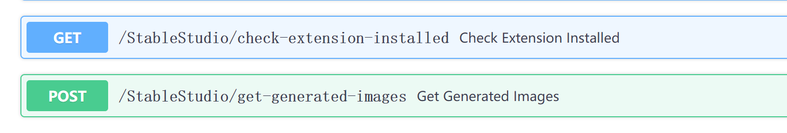

# Stable Diffusion WebUI StableStudio Adapter
A custom extension for [AUTOMATIC1111/stable-diffusion-webui](https://github.com/AUTOMATIC1111/stable-diffusion-webui) to extend rest APIs to do some local operations, using in StableStudio.

## Installation
Just like you install other extension of webui:
1. go to Extensions -> Install from URL
2. paste this repo link
3. install
4. go to Installed, stop, and restart webui with api mode

## APIs use for StableStudio
Since StableStudio needs to make some local operations but webui doesn't provide by default for now, so we need this extension. 
Currently, there are two apis exposed:

1. **/StableStudio/check-extension-installed**  
Not use yet but it will be a good start to check some extensions installed on user webui, for example, ControlNet or Openpose 
2. **/StableStudio/get-generated-images**  
Using for load existing images from user end.

## Credits
Created by [jtydhr88](https://github.com/jtydhr88).
